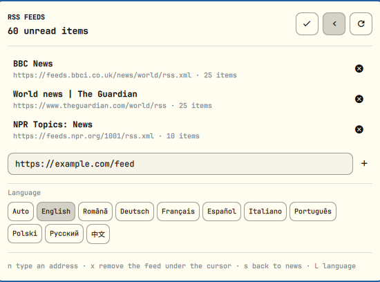

# Știri RSS

Cititor RSS pentru bara Omarchy. În bară stă o pictogramă cu numărul știrilor
necitite; panoul arată lista lor — cu titlul întreg și ilustrația articolului,
când fluxul o oferă — și, pe a doua vedere, administrarea surselor.


Interfața vorbește 10 limbi și urmează, implicit, limba sistemului.

## Ce face

- numără știrile necitite din toate sursele configurate;
- listează știrile din toate sursele într-un singur flux, ordonate după dată;
- deschide o știre în browserul implicit și o marchează citită;
- marchează toate știrile ca citite dintr-un buton;
- adaugă și șterge surse din panou, fără să editezi fișiere.

## Instalare

```bash
omarchy plugin add https://github.com/MariusGhizdavet/omarchy-rss.git
omarchy plugin enable mghizdavet.rss
```

`omarchy plugin add` clonează depozitul în
`~/.config/omarchy/plugins/mghizdavet.rss/` și îl lasă dezactivat, ca să poți
citi întâi codul; `enable` pune widgetul în secțiunea din dreapta a barei.
`omarchy bar move mghizdavet.rss <secțiune>` îl mută în altă parte.

Actualizarea e un fast-forward al aceluiași checkout, cu un diff de citit
înainte:

```bash
omarchy plugin update mghizdavet.rss
```

## Dezinstalare

```bash
omarchy plugin remove mghizdavet.rss
```

Scoate widgetul din bară și șterge checkout-ul. Plugin-ul scrie în exact două
locuri în afara folderului lui și dezinstalarea nu le atinge, deci nu-ți pierzi
lista de surse:

```bash
rm -rf ~/.config/omarchy/rss        # lista ta de surse
rm -f  ~/.local/state/omarchy/rss.json   # ce știri ai citit
```

Nimic altceva din configurația ta nu e scris. Singura linie pe care plugin-ul o
adaugă în `~/.config/omarchy/shell.json` e propria intrare din bară, pusă acolo
de `omarchy plugin enable` și scoasă de `remove`; selectorul de limbă rescrie
doar cheia `language` a acelei intrări, prin `setBarWidget`, apelul shell-ului.

## Interacțiuni

| Unde | Gest | Efect |
|---|---|---|
| bară | click stânga | deschide / închide panoul |
| bară | click dreapta | reîncarcă acum |
| bară | click mijloc | marchează toate ca citite |
| panou | click pe o știre | o deschide în browser și o marchează citită |
| panou | click dreapta pe o știre | comută citit / necitit |
| panou | `j` / `k`, săgeți | mută cursorul prin listă |
| panou | `Enter` / `Space` | deschide știrea de sub cursor |
| panou | `x` | marchează citit (la surse: șterge sursa) |
| panou | `g` sau `Home` | sare la prima știre |
| panou | `a` | marchează toate ca citite |
| panou | `r` | reîncarcă |
| panou | `s` | comută între știri și surse |
| panou | `L` | trece la limba următoare |
| surse | `n` | mută cursorul în câmpul de adăugare |
| surse | `Enter` în câmp | adaugă sursa; `Esc` predă tastele înapoi listei |

## Setări

Se editează în intrarea widget-ului din `~/.config/omarchy/shell.json`.

| Cheie | Implicit | Ce face |
|---|---|---|
| `language` | `Auto` | limba interfeței — vezi mai jos |
| `refreshIntervalSec` | `120` | cât de des se descarcă sursele când ești în priză |
| `refreshIntervalOnBatterySec` | `600` | aceeași cadență, cât timp mergi pe baterie |
| `maxItemsPerFeed` | `25` | câte știri se iau din fiecare sursă |
| `maxItemsShown` | `40` | câte știri intră în panou |
| `timeoutSec` | `12` | cât se așteaptă după o sursă |
| `showCount` | `true` | numărul de lângă pictograma din bară |
| `showThumbnails` | `true` | miniatura articolului |
| `unreadOnly` | `false` | ascunde știrile deja citite |
| `markAllReadOnClose` | `false` | marchează tot citit la închiderea panoului |

Cadența urmărește sursa de curent (`UPower.onBattery`): în priză se preiau
sursele des, pe baterie mai rar, iar în clipa în care conectezi încărcătorul se
face o preluare imediat, fără să aștepți tick-ul. Un desktop, care nu are
baterie, rămâne mereu pe cadența „în priză".

## Limba

`language` primește `Auto` — care urmează limba sistemului și cade pe engleză
când aceea nu e tradusă — sau una dintre:

| | | |
|---|---|---|
| `English` | `Română` | `Deutsch` |
| `Français` | `Español` | `Italiano` |
| `Português (BR)` | `Polski` | `Русский` |
| `中文 (简体)` | | |

Limba se alege din panou — `s` deschide vederea de surse, sau click pe rotiță —
iar `L` trece la următoarea fără mouse:



Merge și codul limbii, deci `"language": "ro"` e același lucru cu
`"language": "Română"`; merge și `"limba"` ca nume de cheie. Datele și formele
de plural urmează limba aleasă, nu pe cea a sistemului — româna primește
`1 știre / 2 știri / 20 de știri`, rusa și poloneza cele trei forme ale lor, iar
numele lunii, la știrile mai vechi de o lună, se scrie în limba aleasă.

Ieșirea comenzilor IPC de mai jos rămâne în engleză oricare ar fi limba
interfeței, ca un script care o parsează să nu depindă de o setare.

> Sistemul tău e pe `en_US`, deci `Auto` ar da engleză; de asta `shell.json`
> are `"language": "Română"` scris explicit.

### Cum adaugi o limbă

Toate textele stau în `I18n.js`, într-un tabel per limbă. Copiază blocul `"en"`,
tradu valorile și adaugă o intrare în `LIMBI`, la începutul fișierului (codul,
numele afișat, locale-ul pentru date și scrierile care trebuie să ducă la ea),
plus numele afișat în opțiunile `language` din `manifest.json`. Dacă pluralul
cere mai multe sau mai puține forme decât două, regula se scrie în
`indexPlural`. Cheile lipsă cad pe engleză, deci o traducere pe jumătate nu
lasă niciodată chei brute pe ecran.

## Surse

La prima rulare — când fișierul acela nu există încă — widget-ul pune o sursă
internațională, **BBC News World**, ca panoul să aibă ce arăta în loc să ceară
mai întâi o adresă. Se scrie o singură dată, pe lipsa fișierului: din clipa în
care fișierul există, o listă goală rămâne goală, deci ștergerea tuturor
surselor ține.

Sursele stau în `~/.config/omarchy/rss/surse.json` și pot fi editate și de
mână — fișierul e urmărit, deci modificările se aplică fără repornirea
shell-ului. Numele lipsă e completat singur din titlul fluxului la prima
preluare reușită.

```json
{
  "version": 1,
  "surse": [
    { "id": "biziday-ro", "nume": "Biziday", "url": "https://www.biziday.ro/feed/" }
  ]
}
```

`feeds` și `name` sunt acceptate ca sinonime pentru `surse` și `nume` la citire,
deci într-un fișier scris de mână merge oricare scriere.

Articolele deja citite se țin separat, în `~/.local/state/omarchy/rss.json`, ca
stare regenerabilă: intrările mai vechi de 90 de zile se curăță singure.

## Din linia de comandă

```bash
omarchy-shell rss toggle
omarchy-shell rss unread
omarchy-shell rss status
omarchy-shell rss refresh
omarchy-shell rss markAllRead
omarchy-shell rss top
omarchy-shell rss listFeeds
omarchy-shell rss addFeed https://exemplu.ro/feed
omarchy-shell rss removeFeed exemplu-ro
omarchy-shell rss language
omarchy-shell rss setLanguage Deutsch
omarchy-shell rss cycleLanguage
```

## Cum e făcut

- `Panel.qml` — widgetul din bară și panoul (cele două vederi, navigarea,
  starea). Nu conține niciun text vizibil; fiecare etichetă vine din `I18n.js`,
  pe cheie.
- `I18n.js` — traducerile, alegerea limbii, regulile de plural și propozițiile
  compuse din mai multe bucăți.
- `Model.js` — forma datelor: raportul preluării, lista de surse, articolele
  citite. Eșecurile circulă drept coduri (`http|404`), nu propoziții, ca să
  poată fi traduse la afișare.
- `bin/rss-preia` — descarcă toate sursele în paralel și scrie un singur JSON pe
  stdout. Înțelege RSS 2.0 și Atom; ilustrația e luată din `media:thumbnail`,
  `media:content`, `enclosure` sau, în lipsa lor, din prima imagine a corpului
  HTML al articolului. Eșecul unei surse ajunge în raport, nu în codul de ieșire.

## Cerințe

`python3` (doar biblioteca standard) și `omarchy-launch-browser`.

## Compatibilitate

Cheile de setări au fost trecute în engleză în 1.1.0. Numele românești de
dinainte (`intervalPeReteaSec`, `arataNumarul` și restul) sunt în continuare
citite, deci un `shell.json` scris pe 1.0.0 nu-și pierde configurația.

## Licență

MIT.
